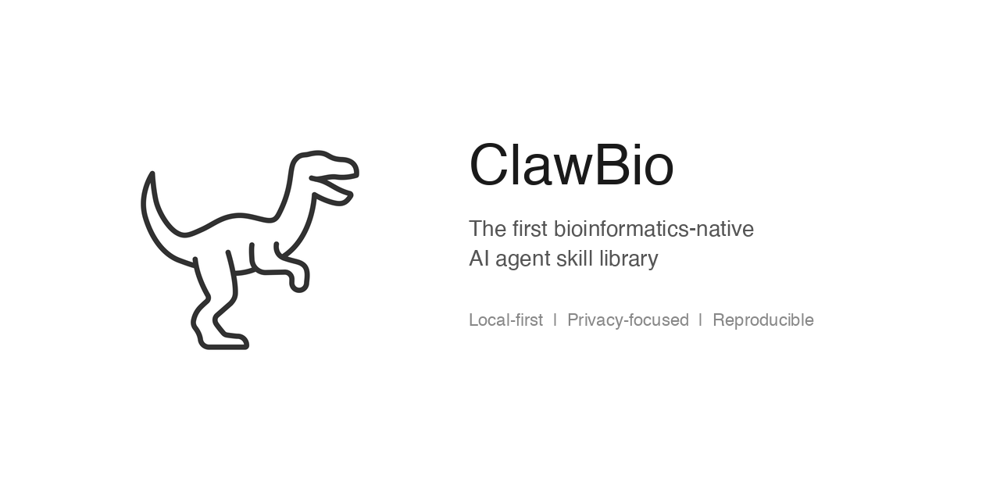

<p align="center">
  
</p>

<h3 align="center">🦖 ClawBio</h3>

<p align="center">
  <strong>The first bioinformatics-native AI agent skill library.</strong><br>
  Built on <a href="https://github.com/openclaw/openclaw">OpenClaw</a> (180k+ GitHub stars). Local-first. Privacy-focused. Reproducible.
</p>

<p align="center">
  <a href="https://github.com/ClawBio/ClawBio/actions/workflows/ci.yml"></a>
  <a href="#quick-start"></a>
  <a href="LICENSE"></a>
  <a href="https://clawhub.ai"></a>
  <a href="https://github.com/ClawBio/ClawBio/issues"></a>
  <a href="https://clawbio.github.io/ClawBio/slides/"></a>
</p>

---

## What ClawBio Does Today

**14 skills and growing. Local-first. No cloud. No guessing.**

Snap a photo of a medication in Telegram. ClawBio identifies the drug from the packaging, queries your pharmacogenomic profile from [your own genome](docs/demo-genome.md), and returns a personalised dosage card — on your machine, in seconds:

<p align="center">
  
</p>

> **Warfarin** | CYP2C9 \*1/\*2 Intermediate · VKORC1 High Sensitivity
> **AVOID — DO NOT USE** · Standard dose causes over-anticoagulation in this genotype.

Or take any genetic variant (identified by its rsID — a unique label like rs9923231) and search nine genomic databases at once to find every known disease association, tissue-specific effect, and population frequency. Or estimate your genetic predisposition to conditions like type 2 diabetes by combining thousands of small-effect variants into a single polygenic risk score. Or explore the [UK Biobank](https://www.ukbiobank.ac.uk/) — a half-million-person research dataset — by asking in plain English what fields measure blood pressure, grip strength, or depression, and get back the exact field IDs, descriptions, and linked publications you need.

Every result ships with a reproducibility bundle: `commands.sh`, `environment.yml`, and SHA-256 checksums. A reviewer can reproduce your Figure 3 in 30 seconds without emailing you.

---

## The Problem

You read a paper. You want to reproduce Figure 3. So you:

1. Go to GitHub. Clone the repo.
2. Wrong Python version. Fix dependencies.
3. Need the reference data — where is it?
4. Download 2GB from Zenodo. **Link is dead.**
5. Email the first author. **Wait 3 weeks.**
6. Paths are hardcoded to `/home/jsmith/data/`.
7. Two days later: still broken. **You give up.**

Now imagine the same paper published a **skill**:

```bash
python ancestry_pca.py --demo --output fig3
# Figure 3 reproduced. Identical. SHA-256 verified. 30 seconds.
```

**That's ClawBio.** Every figure in your paper should be one command away from reproduction.

---

## 🦖 What Is ClawBio?

A **skill** is a domain expert's knowledge — frozen into code — that an AI agent executes correctly every time.

```
ChatGPT / Claude  = a smart generalist who guesses at bioinformatics
🦖 ClawBio skill  = a domain expert's proven pipeline that the AI executes
```

- **Local-first**: Your genomic data never leaves your laptop. No cloud uploads, no data exfiltration.
- **Reproducible**: Every analysis exports `commands.sh`, `environment.yml`, and SHA-256 checksums. Anyone can reproduce it without the agent.
- **Modular**: Each skill is a self-contained directory (`SKILL.md` + Python scripts) that plugs into the orchestrator.
- **MIT licensed**: Open-source, free, community-driven.

## Why Not Just Use ChatGPT?

Ask Claude to "profile my pharmacogenes from this 23andMe file." It'll write plausible Python. But:

- It **hallucinates** star allele calls and uses outdated CPIC guidelines
- It **forgets** CYP2D6 \*4 is no-function (not reduced)
- You spend **45 minutes debugging** its output
- No reproducibility bundle. No audit log. No checksums.

ClawBio encodes the correct bioinformatics decisions so the agent gets it right first time, every time.

---

## 🔍 Provenance & Reproducibility

Every ClawBio analysis ships with a **reproducibility bundle** — not as an afterthought, but as part of the output:

```
report/
├── report.md              # Full analysis with figures and tables
├── figures/               # Publication-quality PNGs
├── tables/                # CSV data tables
├── commands.sh            # Exact commands to reproduce
├── environment.yml        # Conda environment snapshot
└── checksums.sha256       # SHA-256 of every input and output file
```

**Why this matters**: a reviewer can re-run your analysis in 30 seconds. A collaborator can reproduce your Figure 3 without emailing you. Future-you can regenerate results two years later from the same bundle.

---

## 🦖 Skills

| Skill | Status | Description |
|-------|--------|-------------|
| [Bio Orchestrator](skills/bio-orchestrator/) | **MVP** | Routes requests to the right skill automatically |
| [PharmGx Reporter](skills/pharmgx-reporter/) | **MVP** | 12 genes, 51 drugs, CPIC guidelines from consumer genetic data |
| [Drug Photo](skills/drug-photo/) | **MVP** | Snap a medication photo → personalised dosage card from your genotype |
| [ClinPGx](skills/clinpgx/) | **MVP** | Gene-drug lookup from ClinPGx, PharmGKB, CPIC, and FDA drug labels |
| [GWAS Lookup](skills/gwas-lookup/) | **MVP** | Federated variant query across 9 genomic databases |
| [GWAS PRS](skills/gwas-prs/) | **MVP** | Polygenic risk scores from the PGS Catalog for 6+ traits |
| [Profile Report](skills/profile-report/) | **MVP** | Unified personal genomic report: PGx + ancestry + PRS + nutrigenomics |
| [UKB Navigator](skills/ukb-navigator/) | **MVP** | Semantic search across the UK Biobank schema |
| [Equity Scorer](skills/equity-scorer/) | **MVP** | HEIM diversity metrics from VCF or ancestry CSV |
| [NutriGx Advisor](skills/nutrigx_advisor/) | **MVP** *(community)* | Personalised nutrigenomics — 40 SNPs, 13 dietary domains |
| [Metagenomics Profiler](skills/claw-metagenomics/) | **MVP** | Kraken2 / RGI / HUMAnN3 taxonomy, resistome, and functional profiles |
| [Ancestry PCA](skills/claw-ancestry-pca/) | **MVP** | PCA vs SGDP (345 samples, 164 populations) with confidence ellipses |
| [Semantic Similarity](skills/claw-semantic-sim/) | **MVP** | Semantic Isolation Index from 13.1M PubMed abstracts |
| [Genome Comparator](skills/genome-compare/) | **MVP** | Pairwise IBS vs George Church (PGP-1) + ancestry estimation |
| [VCF Annotator](skills/vcf-annotator/) | Planned | Variant annotation with VEP, ClinVar, gnomAD |
| [Lit Synthesizer](skills/lit-synthesizer/) | Planned | PubMed/bioRxiv search with LLM summarisation and citation graphs |
| [scRNA Orchestrator](skills/scrna-orchestrator/) | Planned | Scanpy automation: QC, clustering, DE analysis, visualisation |
| [Struct Predictor](skills/struct-predictor/) | Planned | AlphaFold/Boltz local structure prediction |
| [Repro Enforcer](skills/repro-enforcer/) | Planned | Export any analysis as Conda env + Singularity + Nextflow pipeline |

---

## 🦖 MVP Skills in Detail

### PharmGx Reporter — *Personal Scale*

Generates a pharmacogenomic report from consumer genetic data (23andMe, AncestryDNA):

- Parses raw genetic data (auto-detects format, including gzip)
- Extracts **31 pharmacogenomic SNPs** across **12 genes** (CYP2C19, CYP2D6, CYP2C9, VKORC1, SLCO1B1, DPYD, TPMT, UGT1A1, CYP3A5, CYP2B6, NUDT15, CYP1A2)
- Calls star alleles and determines metabolizer phenotypes
- Looks up **CPIC drug recommendations** for **51 medications**
- Zero dependencies. Runs in **< 1 second**.

```bash
python pharmgx_reporter.py --input demo_patient.txt --output report
```

**Demo result**: CYP2D6 \*4/\*4 (Poor Metabolizer) → **10 drugs AVOID** (codeine, tramadol, 7 TCAs, tamoxifen), 20 caution, 21 standard.

> ~7% of people are CYP2D6 Poor Metabolizers — codeine gives them zero pain relief. ~0.5% carry DPYD variants where standard 5-FU dose can be lethal. This skill catches both.

### Drug Photo — *Personal Scale*

Snap a photo of any medication in Telegram. ClawBio identifies the drug from the packaging and returns a personalised dosage card against your own genotype.

- Claude vision extracts drug name and visible dose from the photo
- Cross-references your 23andMe genotype against 31 PGx SNPs
- Four-tier classification: **STANDARD DOSING / USE WITH CAUTION / AVOID / INSUFFICIENT DATA**
- Correct VKORC1 complement-strand handling (23andMe reports minus strand for rs9923231)
- Works for warfarin, clopidogrel, codeine, simvastatin, tamoxifen, sertraline, and 20+ others

```bash
python pharmgx_reporter.py --drug warfarin --dose "5mg" --input my_23andme.txt --output report
```

> No command needed in Telegram — send any medication photo and RoboTerri triggers the skill automatically.

### GWAS Lookup — *Population Scale*

Federated variant query across nine genomic databases in a single command:

| Database | What you get |
|----------|-------------|
| GWAS Catalog | Genome-wide significant associations |
| gnomAD | Allele frequencies across 125,748 exomes |
| ClinVar | Clinical significance and condition links |
| Open Targets | Disease-gene evidence scores |
| Ensembl | Functional annotation, regulatory impact |
| GTEx | eQTL data, tissue-specific expression effects |
| LDlink | Linkage disequilibrium across 26 populations |
| UK Biobank PheWAS | Phenome-wide associations across 4,000+ traits |
| LOVD | Variant pathogenicity database |

```bash
python gwas_lookup.py --rsid rs3798220 --output report
python gwas_lookup.py --demo --output /tmp/gwas_lookup_demo
```

### UKB Navigator — *Research Scale*

Semantic search across the UK Biobank schema. Ask in plain English what UK Biobank measures about any phenotype — get field IDs, descriptions, data types, participant counts, and linked publications back instantly.

```bash
python ukb_navigator.py --query "grip strength"   --output report
python ukb_navigator.py --field 21001              --output report   # BMI
python ukb_navigator.py --demo                     --output /tmp/ukb_demo
```

Built on a ChromaDB embedding of the full UKB Data Showcase (22,000+ fields).

### Ancestry PCA — *Population Scale*

Runs principal component analysis on your cohort against the SGDP reference panel (345 samples, 164 global populations):

- Contig normalisation (chr1 vs 1)
- IBD removal (related individuals filtered)
- Common biallelic SNPs only
- Confidence ellipses per population
- Publication-quality **4-panel figure** generated instantly

```bash
python ancestry_pca.py --demo --output ancestry_report
```

**Demo result**: 736 Peruvian samples across 28 indigenous populations. Amazonian groups (Matzes, Awajun, Candoshi) sit in genetic space that no SGDP population occupies — genuinely underrepresented, not just in GWAS, but in the reference panels themselves.

### Semantic Similarity Index — *Systemic Scale*

Computes a Semantic Isolation Index for diseases using 13.1M PubMed abstracts and PubMedBERT embeddings (768-dim):

- **SII** (Semantic Isolation Index): higher = more isolated in literature
- **KTP** (Knowledge Transfer Potential): higher = more cross-disease spillover
- **RCC** (Research Clustering Coefficient): diversity of research approaches
- **Temporal Drift**: how research focus evolves over time
- Publication-quality **4-panel figure**

```bash
python semantic_sim.py --demo --output sem_report
```

**Key finding**: Neglected tropical diseases are **+38% more semantically isolated** (P < 0.0001, Cohen's d = 0.84). 14 of the 25 most isolated diseases are Global South priority conditions. Knowledge silos kill innovation — a malaria immunology breakthrough could help leishmaniasis, but the literatures don't talk to each other.

> Corpas et al. (2026). *HEIM: Health Equity Index for Measuring structural bias in biomedical research.* Under review.

---

## Quick Start

```bash
git clone https://github.com/ClawBio/ClawBio.git && cd ClawBio
pip install -r requirements.txt
python clawbio.py run pharmgx --demo
```

PharmGx demo runs in <2 seconds. Only needs Python 3.10+.

### Try all skills

```bash
python clawbio.py list                           # See available skills
python clawbio.py run pharmgx --demo             # Pharmacogenomics (1s)
python clawbio.py run equity --demo              # Equity scoring (55s)
python clawbio.py run nutrigx --demo             # Nutrigenomics (60s)
python clawbio.py run metagenomics --demo        # Metagenomics (3s)
python clawbio.py run compare --demo             # Manuel Corpas vs George Church (10s)
python clawbio.py run gwas-lookup --demo         # rs3798220 across 9 databases (5s)
python clawbio.py run prs --demo                 # Polygenic risk scores (10s)
python clawbio.py run ukb-navigator --demo       # UK Biobank schema search (5s)
python clawbio.py run profile --demo             # Unified genomic profile (30s)
```

### Run with your own data

```bash
python clawbio.py run pharmgx --input my_23andme.txt --output results/
```

### Run tests

```bash
pip install pytest
python -m pytest
```

---

## Run via Telegram (RoboTerri)

<p align="center">
  
  <br><em>RoboTerri — ClawBio's Telegram agent, inspired by <a href="https://en.wikipedia.org/wiki/Teresa_Attwood">Prof. Teresa K. Attwood</a></em>
</p>

ClawBio skills are also available through **RoboTerri**, a Telegram AI agent named after [Prof. Teresa K. Attwood](https://en.wikipedia.org/wiki/Teresa_Attwood) — a pioneer of bioinformatics education, founding Chair of GOBLET, and winner of the 2021 ISCB Outstanding Contributions Award. Send a genetic data file, a medication photo, or a plain-English question. Get back a summary, full report, and figures directly in Telegram.

> **[Install RoboTerri — Step-by-step tutorial](docs/tutorial-roboterri-install.md)**: Set up your own Telegram bot running ClawBio skills in ~20 minutes.

```
You:        [send 23andMe file]
RoboTerri:  Running PharmGx Reporter...
            CYP2D6 *4/*4 — Poor Metabolizer → 10 drugs AVOID
            [report.md attached]
            [3 figures attached]

You:        [send photo of warfarin packet]
RoboTerri:  Warfarin detected. Running Drug Photo skill...
            CYP2C9 *1/*2 · VKORC1 High Sensitivity
            AVOID — DO NOT USE at standard dose.

You:        run gwas-lookup rs3798220
RoboTerri:  Querying 9 databases...
            rs3798220 (LPA) — coronary artery disease, Lp(a) levels.
            eQTL in liver (GTEx). gnomAD MAF 0.07.
```

RoboTerri auto-detects file type (23andMe `.txt`, AncestryDNA `.csv`, VCF, FASTQ) and routes to the right skill via the Bio Orchestrator. Photos of medications trigger the Drug Photo skill automatically — no command needed.

---

## 🦖 Architecture

```
Telegram (RoboTerri)     CLI (clawbio.py)     Python (import clawbio)
         │                      │                       │
         └──────────┬───────────┘───────────────────────┘
                    │
             ┌──────▼──────┐
             │  Bio         │  ← routes by file type + keywords
             │  Orchestrator│
             └──────┬──────┘
                    │
  ┌─────────────────▼──────────────────────────────────────┐
  │                                                         │
  PharmGx    Equity     NutriGx    Metagenomics   Ancestry
  Reporter   Scorer     Advisor    Profiler        PCA    ...
  │                                                         │
  └─────────────────┬──────────────────────────────────────┘
                    │
             ┌──────▼──────┐
             │  Markdown    │  ← report + figures + checksums
             │  Report      │     + reproducibility bundle
             └─────────────┘
```

Each skill is standalone — the orchestrator routes to the right one, but every skill also works independently. The `clawbio.run_skill()` API is importable by any agent (RoboTerri, RoboIsaac, Claude Code).

See [docs/architecture.md](docs/architecture.md) for the full design.

---

## Community Wanted Skills 🦖

We want skills from the bioinformatics community. If you work with genomics, proteomics, metabolomics, imaging, or clinical data — **wrap your pipeline as a skill**.

| Skill | What | Your expertise |
|-------|------|----------------|
| **claw-gwas** | PLINK/REGENIE automation | Statistical genetics |
| **claw-acmg** | Clinical variant classification | Clinical genomics |
| **claw-pathway** | GO/KEGG enrichment | Functional genomics |
| **claw-phylogenetics** | IQ-TREE/RAxML automation | Evolutionary biology |
| **claw-proteomics** | MaxQuant/DIA-NN | Proteomics |
| **claw-spatial** | Visium/MERFISH | Spatial transcriptomics |

See [CONTRIBUTING.md](CONTRIBUTING.md) for the submission process and [templates/SKILL-TEMPLATE.md](templates/SKILL-TEMPLATE.md) for the skill template.

---

## In the Wild

ClawBio is built on [OpenClaw](https://github.com/openclaw/openclaw). On 1 March 2026, at the UK AI Agent Hack at Imperial College London, Manuel Corpas introduced ClawBio to Peter Steinberger — the creator of OpenClaw itself.

<p align="center">
  <a href="https://www.youtube.com/watch?v=eEEA71qSOmU">
    
  </a>
  <br><em>Manuel Corpas introduces ClawBio to Peter Steinberger · UK AI Agent Hack, Imperial College London · <a href="https://www.youtube.com/watch?v=eEEA71qSOmU">Watch on YouTube →</a></em>
</p>

---

## Presentation

ClawBio was announced at the **London Bioinformatics Meetup** on 26 February 2026.

- **Slides**: [clawbio.github.io/ClawBio/slides/](https://clawbio.github.io/ClawBio/slides/)
- **Talk**: *10 Tips for Becoming a Top 1% AI User* — with live demos of all three MVP skills

---

## Citation

If you use ClawBio in your research, please cite:

```bibtex
@software{clawbio_2026,
  author = {Corpas, Manuel},
  title = {ClawBio: An Open-Source Library of AI Agent Skills for Reproducible Bioinformatics},
  year = {2026},
  url = {https://github.com/ClawBio/ClawBio}
}
```

## Links

- 🦖 **Slides**: [clawbio.github.io/ClawBio/slides/](https://clawbio.github.io/ClawBio/slides/)
- 🦖 **Tutorial**: [Install RoboTerri (Telegram agent)](docs/tutorial-roboterri-install.md)
- [OpenClaw](https://github.com/openclaw/openclaw) — The agent platform
- [ClawHub](https://clawhub.ai) — Skill registry
- [HEIM Index](https://heim-index.org) — Health Equity Index for Minorities

## License

MIT — clone it, run it, build a skill, submit a PR. 🦖
